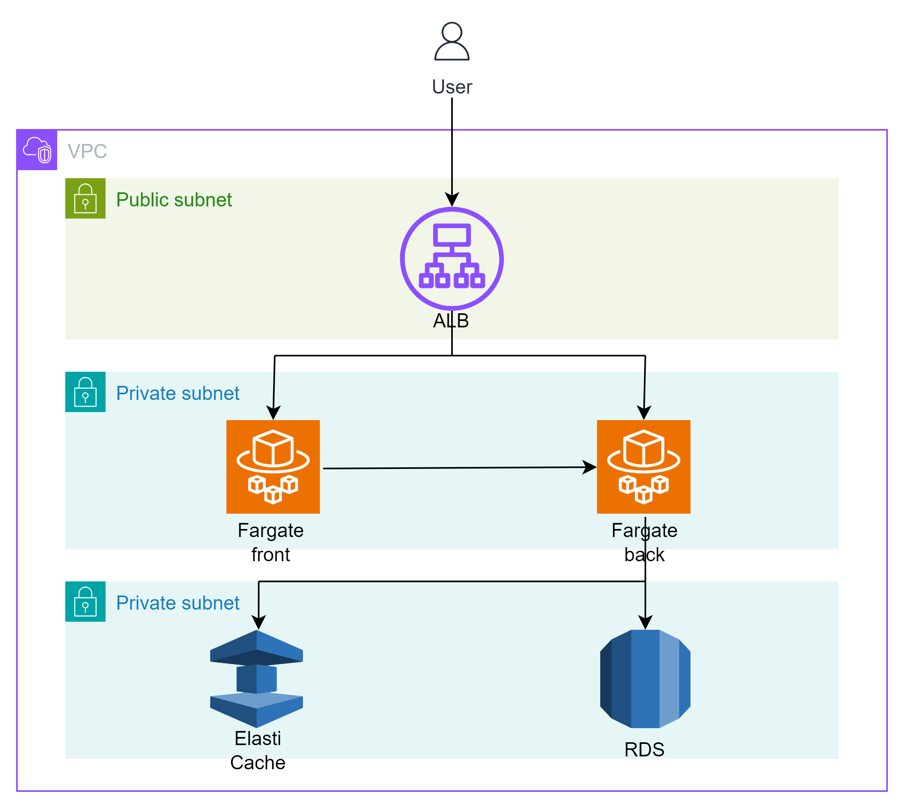

# AWS Cloud Development Kit (AWS CDK) プロジェクト

## 概要

このプロジェクトは、AWS Cloud Development Kit (AWS CDK)を使用して、AWSのALB、ECS(Fargate)、RDS、ElastiCacheを作成するためのものです。
ECSはフロントエンド用とバックエンド用の2つを用意しています。これにより、開発者は簡単にAWSの各種サービスを組み合わせて使用することができます。

主な機能は次のとおりです：
- ALB（Application Load Balancer）の作成：アプリケーションの負荷分散を行います。
- ECS（Elastic Container Service）の作成：フロントエンドとバックエンドのDockerコンテナの運用を自動化します。
- RDS（Relational Database Service）の作成：リレーショナルデータベースの設定、運用、スケーリングを自動化します。
- ElastiCacheの作成：インメモリデータストアまたはキャッシュ環境の設定、運用、スケーリングを自動化します。

例えば、Webアプリケーションをホストするためには、ALBを使用してトラフィックを適切に分散し、ECSを使用してフロントエンドとバックエンドのアプリケーションをホストし、RDSを使用してデータベースを管理し、ElastiCacheを使用してパフォーマンスを向上させることができます。

## 構成図

## 必要条件

このプロジェクトを実行するためには、以下のものが必要です：

1. **Node.js**：AWS CDKはNode.jsで動作します。Node.jsの最新バージョンをインストールしてください。

2. **AWSアカウント**：このプロジェクトはAWSのリソースを作成します。そのため、AWSアカウントが必要です。

3. **AWS CLI**：AWS CLIを使用して、AWSの設定を行います。AWS CLIの最新バージョンをインストールしてください。

4. **Git**：このプロジェクトのソースコードをクローンするために、Gitが必要です。

これらの条件を満たしていることを確認した上で、インストール手順に進んでください。

## セットアップ・使用方法

1. **リポジトリのクローン**：このリポジトリをローカルマシンにクローンします。

    ```
    git clone https://github.com/aws-ecs.git
    ```

2. **ディレクトリの移動**：クローンしたリポジトリのディレクトリに移動します。

    ```
    cd aws-ecs
    ```

3. **依存関係のインストール**：プロジェクトの依存関係をインストールします。

    ```
    npm install
    ```
4. **AWS CDKのインストール**：まだインストールしていない場合は、以下のコマンドでAWS CDKをグローバルにインストールします。

    ```
    npm install -g aws-cdk
    ```

5. **AWS環境の設定**：AWS CLIを使用して、AWS環境を設定します。

    ```
    aws configure
    ```

6. **AWSリソースのデプロイ**：AWS CDKを使用して、AWSリソースをデプロイします。

    ```
    cdk deploy
    ```

これで、AWSのALB、ECS(Fargate)、RDS、ElastiCacheが作成され、プロジェクトが稼働し始めます。

7. **AWSリソースの削除**: デプロイしたAWSリソースが不要になったら削除します。
   ```
   cdk destroy
   ```

## ライセンス
このプロジェクトはMITライセンスの下でライセンスされています。
詳細はLICENSEファイルをご覧ください。